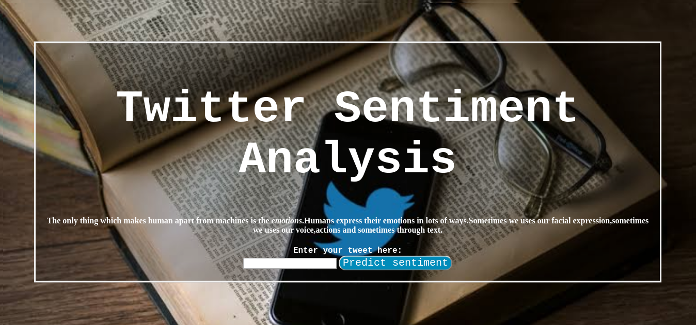

<html>

<body>
 
  <h1>Twitter Sentiment Analysis</h1>
  
  <h4>This project is developed by using <b>Sentiment140 kaggle dataset</b>,it has collection of 1.6 million tweets.This project uses Stacking model of Logistic Regression and Naive Bayes.It has been deployed on Heroku with the help of Flask. 
Accuracy of Model ==> 77.34%
 Link ==> <a href="https://sentimentanalysis-twitter.herokuapp.com"> https://sentimentanalysis-twitter.herokuapp.com</a> </h4>
</body>
</html>
